 
## 查看主页获取源码

> **作者介绍**： **✌**全网粉丝10W+本平台特邀作者、博客专家、CSDN新星计划导师、java领域优质创作者,博客之星、掘金/华为云/阿里云/InfoQ等平台优质作者、专注于毕业项目实战 **✌**

  

### 一、作品包含

源码+数据库+设计文档万字+全套环境和工具资源+部署教程

### 二、项目技术

前端技术：Html、Css、Js、Vue、Element-ui

数据库：MySQL

后端技术：Java、Spring Boot、MyBatis

  

### 三、运行环境

开发工具：IDEA

数据库：MySQL8.0

数据库管理工具：Navicat10以上版本

环境配置软件： JDK1.8+Maven3.6.3

  

### 四、项目介绍
项目编号：springbootA030

排课问题是个复杂的问题，这个系统只是用遗传算法解决了基本的硬约束问题。必需要解决的问题称为硬约束 就是 教师+教室+班级+课程+时间 五个基本条件的关联与冲突的问题

### 五、运行截图

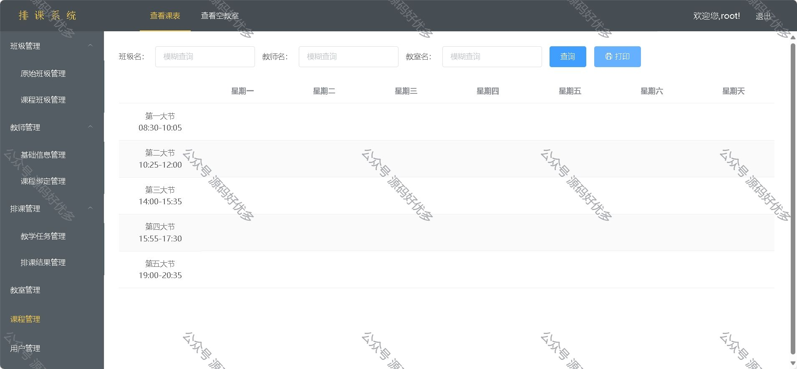
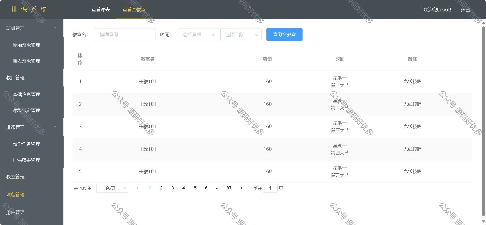
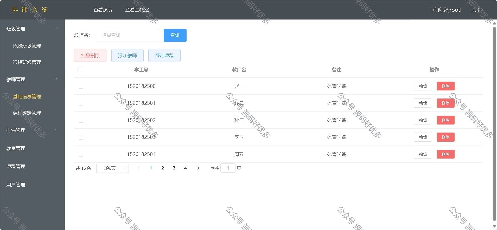
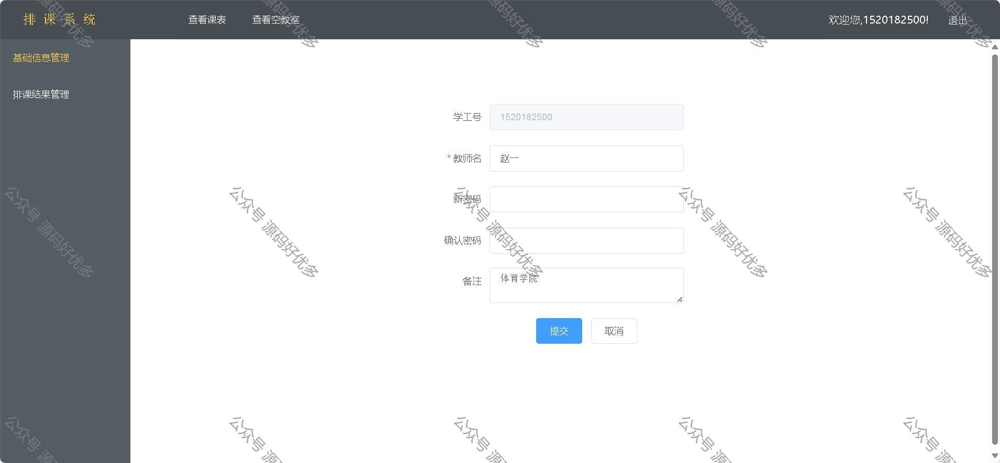

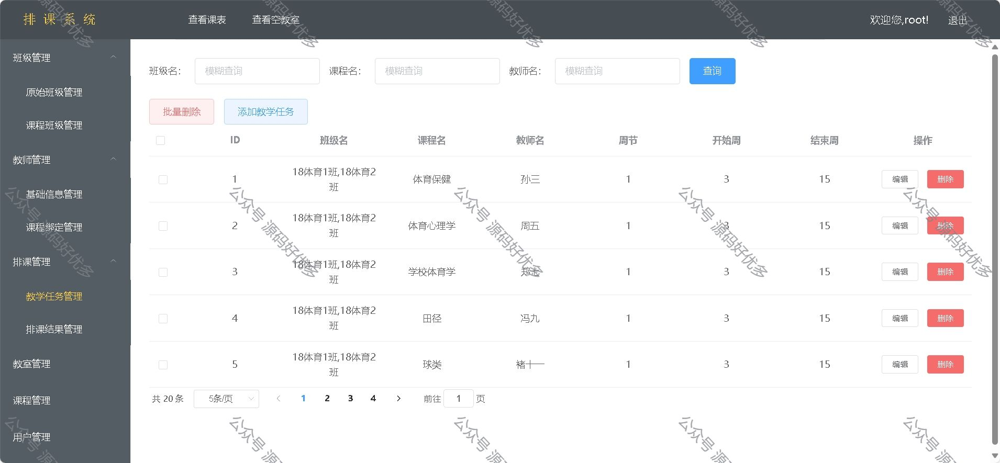
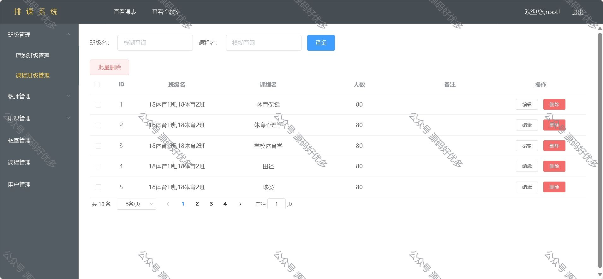
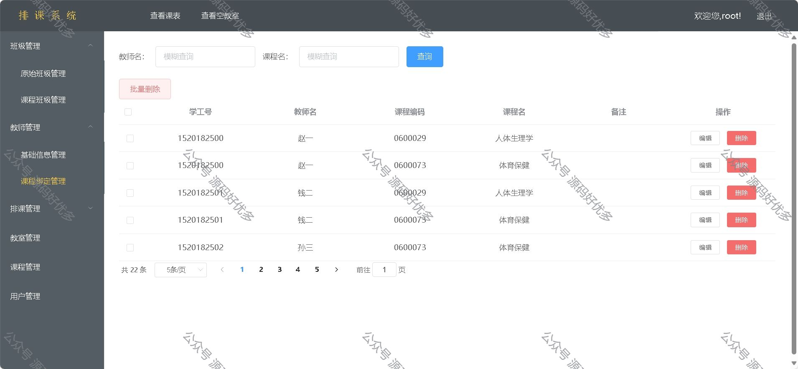
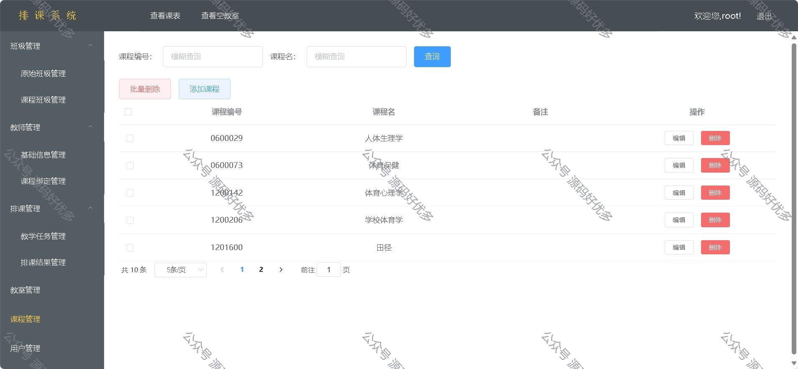
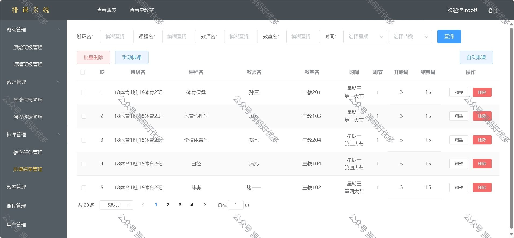
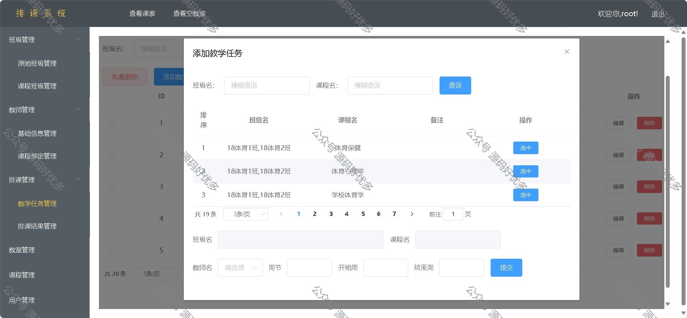
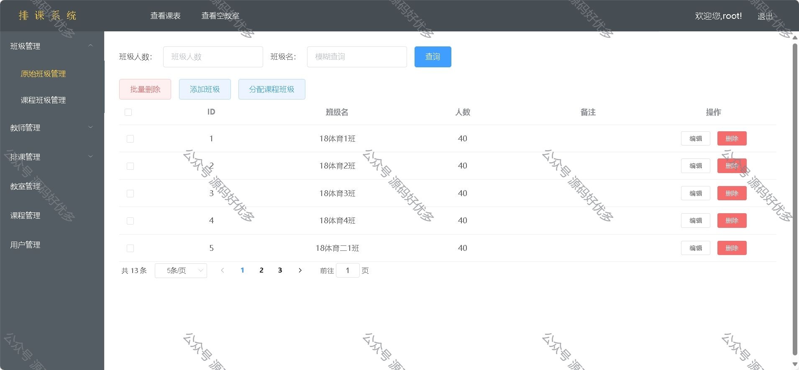
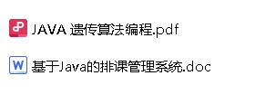

  
